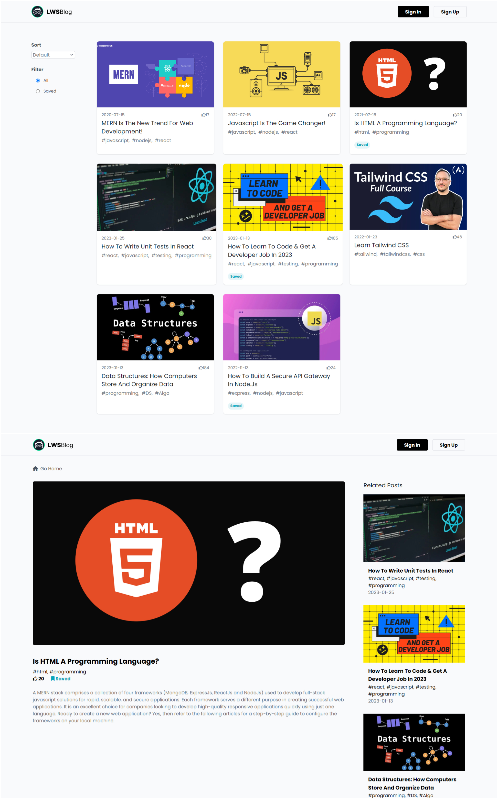

# Blog Application with React Redux-Toolkit  

This is a blog application that allows users to view and interact with blog posts. It includes features such as sorting by date or likes, saving posts, and displaying related posts.

## Technologies Used

- React JS
- React Router
- Redux-Thunk

## Features

- View blog posts on home page

- Sort posts by date or likes

- Like posts to increase their popularity (synced with server)

- Bookmark(save) posts to save them (synced with server)

- View Bookmarked(saved) posts by filtering

- View details of a post (including related posts by tag)

## Live Preview

Click [here](https://blog-app-reduxtoolkit-by-adnan-sarkar.netlify.app/) to view a live preview of the application.

## Screenshots

## Credits

This project was completed as part of the `Think in a Redux Way` course on [learn with sumit](https://learnwithsumit.com/) platform. The HTML-CSS template used for the project was also provided by the platform.
